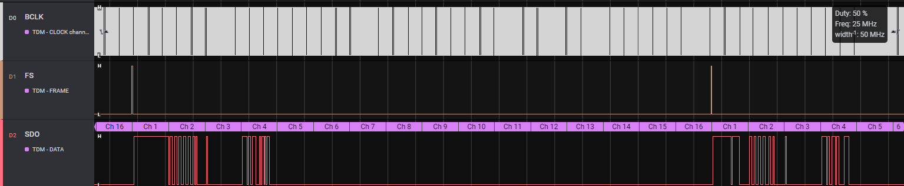
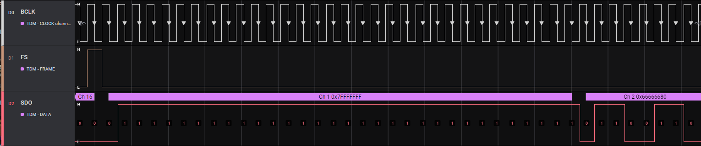
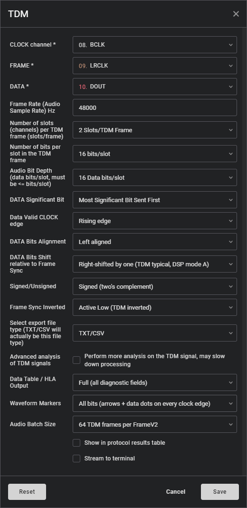
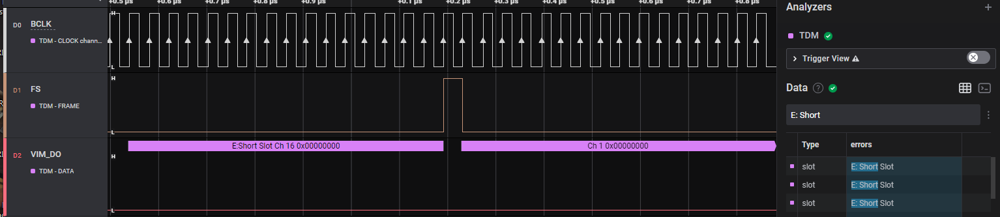
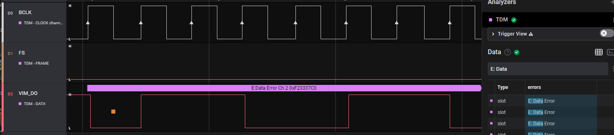
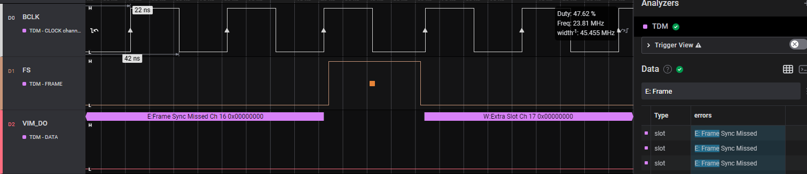
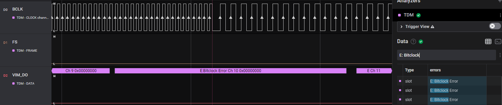
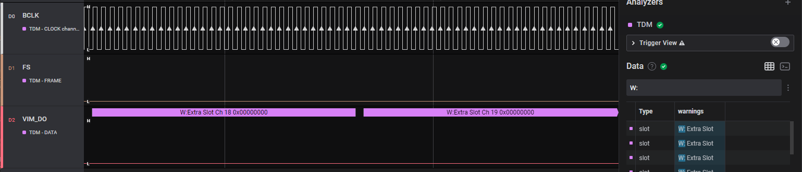
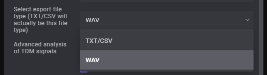
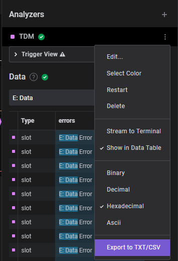

# TDM Analyzer

 TDM Analyzer for decoding TDM data.




 # Features

- 1 to 256 slots per frame
- Slot sizes from 2 to 64 bits
- data bits / slot from 2 to 64 bits
- Data can be exported as a `.wav` or a `.csv` file
- Frame sync can be asserted on last bit before a new frame, or on first bit of new frame
- Rising or falling frame sync sensitivity
- Rising or falling bit clock data latching
- Data can be right or left justified in the slot
- Data can be decoded most significant or least significant bit first
- Generates warnings for extra unexpected slots
- Generates warnings for truncated slots
- Searchable warnings and errors in protocol table

# Advanced Analysis features
- Checks for bitclock discrepencies and generates an error
- Identifies and marks slots with data changing that is not captured by the bitclock
- Identifies and marks missed frame sync pulses

# Settings



## Searching for errors or warnings

## Supported Errors and Warnings

_Note:_ Certain errors and warnings are only available with the `Advanced analysis` option enabled in the analyzer settings.  When advanced analysis is not enabled, each slot will show the sampled bits when zoomed in.  Due to the other markers placed on the serial data, these bits are not shown when advanced analysis is enabled.


- Search for the following in the protocol table to quickly locate any errors or warnings
 - `E:` to find errors
 - `W:` to find warnings

### E: Short Slot
  - Available all the time
  - Flag `0x08`
  - The expected number of bits for the slot were not captured.  This will occur even if the missing bits are not data bits.  For example, if the expected number of bits per slot is 32, and there are 16 data bits in the slot, you will receive a warning if anything less than 32 bits is counted for the slot.



### E: Data Error
  - Only Available if the `Advanced analysis` option is enabled.
  - Flag `0x04`
  - If the serial data transitions twice between valid bitclock edges (detected by neither clock edge), there may be missed data.  The slot will be flagged and a marker will be placed on the suspect data.



### E: Frame Sync Missed
  - Only Available if the `Advanced analysis` option is enabled.
  - Flag `0x10`
  - The frame sync transitioned twice between valid bitclock edges and a new frame was not detected.  The slot will be flagged and a marker will be placed on the suspect frame sync.



### E: Bitclock Error
  - Only Available if the `Advanced analysis` option is enabled.
  - Flag `0x20`
  - Using the sample rate, number of slots per frame, and slot size an expected bitclock rate is calculated.  If the bitclock varies outside of this expected frequency by more than 1 Logic analyzer sample, the slot is flagged.



### W: Extra Slot
  - Available all the time
  - Flag `0x02`
  - If a frame sync has not occurred and the number of slots has increased beyond the number of slots in the analyzer settings, this warning will be placed on all slots greater than the expected number of slots.



_Note:_ These errors can also occur because of misconfiguration of the analyzer settings.

## Flag values

When exporting data as a CSV / TXT file, there will be a flag field.  The flags are defined as:

```c
UNEXPECTED_BITS         ( 1 << 1 ) // 0x02
MISSED_DATA             ( 1 << 2 ) // 0x04
SHORT_SLOT              ( 1 << 3 ) // 0x08
MISSED_FRAME_SYNC       ( 1 << 4 ) // 0x10
BITCLOCK_ERROR          ( 1 << 5 ) // 0x20
WARNING                 ( 1 << 6 ) // 0x40
ERROR                   ( 1 << 7 ) // 0x80
```

# Exporting data as a wave file

There is a bug in Logic 2 where the displayed export options are limited to `TXT/CSV`.  This bug is still present in Logic v2.3.58 (when this analyzer was authored).  The way to work around this is to add a setting into the analyzer to select what "export to TXT/CSV" will _actually_ do.  To export the captured data as a wave file, follow these steps:

1. Open the analyzer settings, click on the "Select export file type" dropdown and select "WAV" from the list. 
1. Save the settings
1. When analysis is complete, click on the three dots next to the analyzer and select "Export to TXT/CSV" 
1. Once the file is writted, the contents of the file will be set based on the export file type in the analyzer settings, but the extension will always be either `.txt` or `.csv` depending on what you selected when you saved the file.  _You must change the extension yourself after the data is exported._

### Things to be aware of when exporting a wav file

- The sample rate for the exported wave file is set from the sample rate in the analyzer settings
- The number of channels is set from the number of slots in the analyzer settings.
  - If the data contains more slots per frame than specified in the settings, the extra slots will be ignored and not put into the wave file
  - If the data contains less slots per frame than specified in the settings, the frame sync signal will be ignored and the slots will populate the wave file as if they were in order.  For example, if you specified 4 slots per frame in the settings, but the data only contains 3 slots per frame, then the wave file will be populated with 4 channels per sample consiting of:
  ```
  // F# is frame number and S# is slot #. So F3S2 is frame 3 slot 2's data
  [F1S1, F1S2, F1S3, F2S1]
  [F2S2, F2S3, F3S1, F3S2]
  [F3S3, F4S1, F4S2, F4S3] 
  ...
  ```
- Data in the wave file is stored in the following bit depth:
  ```
   2 -  8 data bits :  8 bits per channel
   9 - 16 data bits : 16 bits per channel
  17 - 32 data bits : 32 bits per channel
  33 - 40 data bits : 40 bits per channel
  41 - 48 data bits : 48 bits per channel
  49 - 64 data bits : 64 bits per channel
  ```
- Data bits above 32 are "supported" but are not likely to to open.
- The wave file header is always a standard PCM header.  This header has been tested to work with channel counts > 2 and bit depths <= 32 bits in Audacity.  There is an extended PCM header option in the code, but it is not currently used.  A future version of the analyzer might select between then standard header and extended header based on slots / frame and number of data bits if there is evidence that it is needed.
- Data bits are always scaled to ensure that the maximum values are always achievable.\
  - For example, this means that with 2 data bits, the range will map to
    ```
    0x1 -> +0.5
    0x0 ->  0
    0x3 -> -0.5
    0x2 -> -1.0
    ```
- The headers of the wave file are updated every 10 ms of audio data, so if the analyzer crashes or the export is cancelled early, the most data that will be lost is the most recently written 10 ms.

# Building instructions

### MacOS

Dependencies:
- XCode with command line tools
- CMake 3.13+

Installing command line tools after XCode is installed:
```
xcode-select --install
```

Then open XCode, open Preferences from the main menu, go to locations, and select the only option under 'Command line tools'.

Installing CMake on MacOS:

1. Download the binary distribution for MacOS, `cmake-*-Darwin-x86_64.dmg`
2. Install the usual way by dragging into applications.
3. Open a terminal and run the following:
```
/Applications/CMake.app/Contents/bin/cmake-gui --install
```
*Note: Errors may occur if older versions of CMake are installed.*

Building the analyzer:
```
mkdir build
cd build
cmake ..
cmake --build .
```

### Ubuntu 16.04

Dependencies:
- CMake 3.13+
- gcc 4.8+

Misc dependencies:

```
sudo apt-get install build-essential
```

Building the analyzer (oringinal instructions):
```
mkdir build
cd build
cmake ..
cmake --build .
# and to clean
cmake --build . --target clean
```

Building the analyzer (release):
```
cmake -S . -B build-release -DCMAKE_BUILD_TYPE=Release # setup for a release build
cmake --build build-release # build a release version
```

Building the analyzer (debug):
```
cmake -S . -B build-debug -DCMAKE_BUILD_TYPE=Debug # setup for a debug build
cmake --build build-debug # build a debug version
```

Cleaning:
```
cmake --build build-debug --target clean
# -or-
cmake --build build-release --target clean
```

Debugging on linux with the app image:
You will need to attach gdb to a specifc running process because the *.AppImage program distributed is actually an AppImage wrapper around the Logic software. However, the launched process doesn’t load your analyzer either, it launches another instance of itself which eventually loads your analyzer.

How to identify the process you will want to debug:

1. Open the Logic 2 app and add your analyzer. (It needs to be added for the lib to be loaded). The app will load and then unload the lib once at startup to get its identification, but the shared library isn’t loaded again until you add it.
1. Run `ps ax | grep Logic`
1. There should be at least 7 matches. Several will have the path `/tmp/.mount_Logic-XXXXXX/Logic`. Of those items, look for ones that have the argument `--type=renderer`. There may be two of them. Note their process IDs.
1. To figure out which one has loaded your library, run `lsof -p <process id> | grep libtdm_analyzer.so`
1. One of the two process IDs will have a match, the other will not (see below for a command that will help with finding the PID).
1. Then, run `gdb ./libtdm_analyzer.so`. Then type `attach <process id>`.
1. `break TdmAnalyzer::WorkerThread`

_Note:_ If you run into an operation not permitted, you can run `sudo sysctl -w kernel.yama.ptrace_scope=0`

oneliner to get the proper process ID:
`ps aux | grep 'Logic' | awk '{print $2}' | xargs -I % lsof -p % | grep libtdm_analyzer.so | awk '{print $2}'`

_How it works:_ find all processes with 'Logic' in the name (`ps aux | grep 'Logic'`) and grab the second field which is the process ID (`| awk '{print $2}'`)
and pass that list to xargs which places the PID as the argument to lsof (`| xargs -I % lsof -p %`) pass this to grep to find the process
that has the libtdm_analyzer.so loaded (`| grep libtdm_analyzer.so`) then print the second field, which is the process ID (`| awk '{print $2}'`)

### How did I figure some of this stuff out?
- make a debug build with cmake : https://hsf-training.github.io/hsf-training-cmake-webpage/08-debugging/index.html
- debug with the appimage : https://discuss.saleae.com/t/failed-to-load-custom-analyzer/903/6


### Windows

Dependencies:
- Visual Studio 2015 Update 3
- CMake 3.13+

**Visual Studio 2015**

*Note - newer versions of Visual Studio should be fine.*

Setup options:
- Programming Languages > Visual C++ > select all sub-components.

Note - if CMake has any problems with the MSVC compiler, it's likely a component is missing.

**CMake**

Download and install the latest CMake release here.
https://cmake.org/download/

Building the analyzer:
```
mkdir build
cd build
cmake .. -A x64
```

Then, open the newly created solution file located here: `build\tdm_analyzer.sln`


## Output Frame Format
  
### Frame Type: `"error"`

| Property | Type | Description |
| :--- | :--- | :--- |
| `error` | str | Error details. TDM errors usually indicate the wrong number of bits inside of a frame |

TDM decode error

### Frame Type: `"data"`

| Property | Type | Description |
| :--- | :--- | :--- |
| `channel` | int | channel index. 0 or 1 |
| `data` | int | Audio value. signed or unsigned, based on TDM analyzer settings |

A single sample from a single channel

