# TDM Analyzer

A Saleae Logic 2 analyzer for decoding TDM audio data — from raw bitclock and frame sync signals to playable audio in real time.

- **Decode** — Supports 1-256 slots, 2-64 bit depth, MSB/LSB, left/right justified, with full error detection
- **Stream** — Hear decoded audio live through your speakers or route it to a virtual sound card (VB-Cable, BlackHole) for recording in any DAW
- **Export** — Write selected slots to WAV files in real time during capture, with RF64 support for recordings over 4 GiB

[](https://buymeacoffee.com/bitswype)

## Table of Contents

- [Low Level Analyzer (LLA)](#low-level-analyzer-lla)
  - [Features](#features)
  - [Advanced Analysis Features](#advanced-analysis-features)
  - [Settings](#settings)
  - [Performance Tuning](#performance-tuning)
  - [Exporting data as a wave file](#exporting-data-as-a-wave-file)
- [High Level Analyzers (HLAs)](#high-level-analyzers-hlas)
  - [HLA: TDM WAV Export](#hla-tdm-wav-export)
  - [HLA: TDM Audio Stream](#hla-tdm-audio-stream) (with streaming quick start)
- [Known Limitations](#known-limitations)
- [Install instructions](#install-instructions)
- [Building from source](#building-from-source)
- [Debugging on Linux](#debugging-on-linux)
- [Migration Guide](#migration-guide)

# Low Level Analyzer (LLA)

The C++ LLA plugin decodes raw TDM signals — bitclock, frame sync, and serial
data — into structured slot frames with full error detection.

## Features

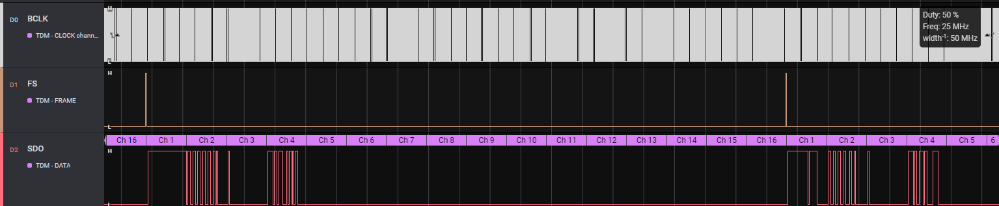
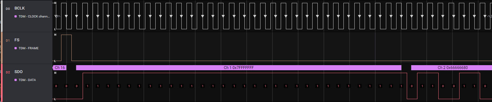

- 1 to 256 slots per frame
- Slot sizes from 2 to 64 bits
- data bits / slot from 2 to 64 bits
- Data can be exported as a `.wav` or a `.csv` file
- Live audio streaming over TCP with companion playback CLI and GUI
- Frame sync can be asserted on last bit before a new frame, or on first bit of new frame
- Rising or falling frame sync sensitivity
- Rising or falling bit clock data latching
- Data can be right or left justified in the slot
- Data can be decoded most significant or least significant bit first
- Generates warnings for extra unexpected slots
- Generates warnings for truncated slots
- Searchable warnings and errors in protocol table

## Advanced Analysis Features
- Checks for bitclock discrepancies and generates an error
- Identifies and marks slots with data changing that is not captured by the bitclock
- Identifies and marks missed frame sync pulses

## Settings

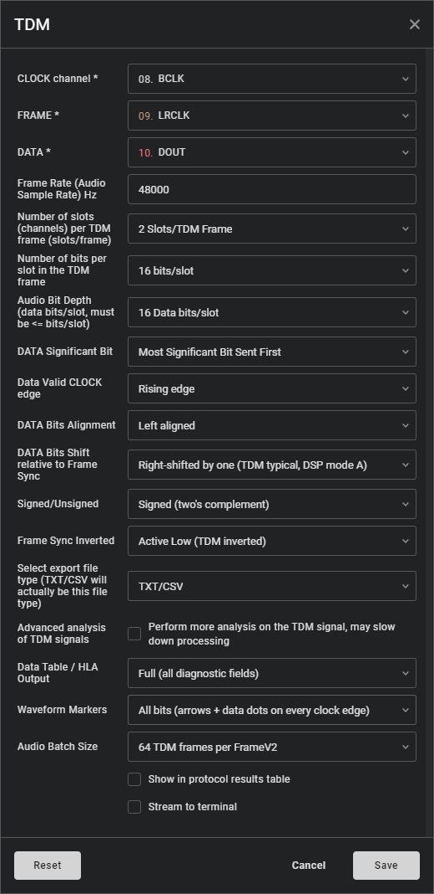

### Supported Errors and Warnings

_Note:_ Certain errors and warnings are only available with the `Advanced analysis` option enabled in the analyzer settings.  When advanced analysis is not enabled, each slot will show the sampled bits when zoomed in.  Due to the other markers placed on the serial data, these bits are not shown when advanced analysis is enabled.

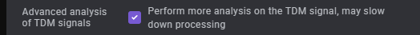

- Search for the following in the protocol table to quickly locate any errors or warnings
 - `E:` to find errors
 - `W:` to find warnings

#### E: Short Slot
  - Available all the time
  - Flag `0x08`
  - The expected number of bits for the slot were not captured.  This will occur even if the missing bits are not data bits.  For example, if the expected number of bits per slot is 32, and there are 16 left justified data bits in the slot, you will receive a warning if anything less than 32 bits is counted for the slot.  This error will only ever occur on the last slot of a frame.

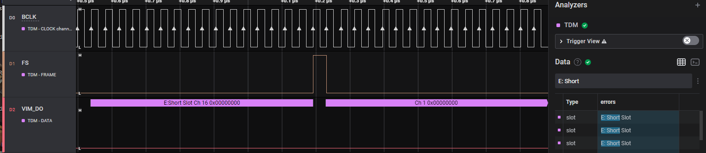

#### E: Data Error
  - Only Available if the `Advanced analysis` option is enabled.
  - Flag `0x04`
  - If the serial data transitions twice between valid bitclock edges (meaning the data change is not detected either bitclock edge), there may be missed data.  The slot will be flagged and a marker will be placed on the suspect data.

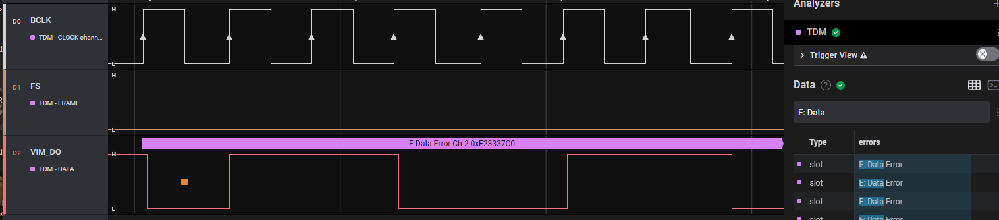

#### E: Frame Sync Missed
  - Only Available if the `Advanced analysis` option is enabled.
  - Flag `0x10`
  - The frame sync transitioned twice between valid bitclock edges and a new frame was not detected.  The slot will be flagged and a marker will be placed on the suspect frame sync.

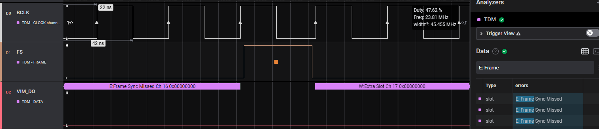

#### E: Bitclock Error
  - Only Available if the `Advanced analysis` option is enabled.
  - Flag `0x20`
  - Using the sample rate, number of slots per frame, and slot size, an expected bitclock rate is calculated.  If the bitclock varies outside of this expected frequency by more than 1 Logic analyzer sample, the slot is flagged.

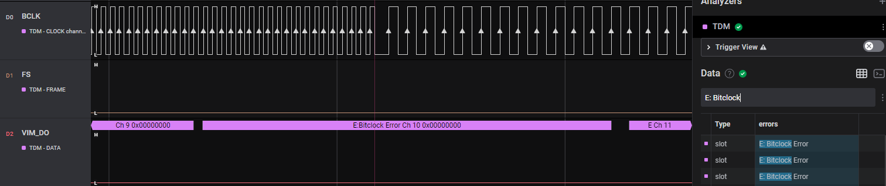

#### W: Extra Slot
  - Available all the time
  - Flag `0x02`
  - If a frame sync has not occurred and the number of slots has increased beyond the number of slots in the analyzer settings, this warning will be placed on all slots greater than the expected number of slots.

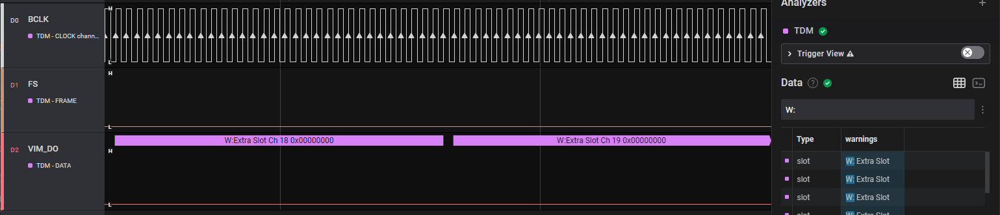

_Note:_ These errors can also occur because of misconfiguration of the analyzer settings.

### Flag values

When exporting data as a CSV / TXT file, there will be a flag field.  The flags are defined as:

```c
UNEXPECTED_BITS         ( 1 << 1 ) // 0x02
MISSED_DATA             ( 1 << 2 ) // 0x04
SHORT_SLOT              ( 1 << 3 ) // 0x08
MISSED_FRAME_SYNC       ( 1 << 4 ) // 0x10
BITCLOCK_ERROR          ( 1 << 5 ) // 0x20
WARNING                 ( 1 << 6 ) // 0x40
ERROR                   ( 1 << 7 ) // 0x80
```

## Performance Tuning

Three analyzer settings control the speed/detail tradeoff:

- **Data Table / HLA Output**: Full (all 10 FrameV2 fields), Minimal (5 fields needed by audio HLAs), or Off (no FrameV2, maximum speed). Default: Full.
- **Waveform Markers**: All bits (per-bit arrows + data dots), Slot boundaries only, or None. Default: All bits.
- **Audio Batch Size**: Off (one FrameV2 per slot, default) or 1-1024 TDM frames per FrameV2 (powers of 2). **Required for real-time streaming at stereo 48kHz or above.** When enabled, the Data Table / HLA Output setting is ignored and only batch frames with packed PCM data are emitted. V1 Frames, markers, and bubble text are unaffected.

### Audio Batch Mode (for real-time streaming)

Logic 2's HLA pipeline can process approximately 50,000 decode() calls per second. Without batching, stereo 48kHz I2S generates 96,000 calls/sec (one per slot) - only ~54% of real-time:

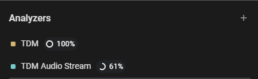

Audio Batch Mode packs N TDM frames into a single FrameV2 with a PCM byte array, dramatically reducing calls:

| Batch Size | Stereo 48kHz calls/sec | Real-time? |
|----------:|----------------------:|:----------:|
| Off       | 96,000                | No (~54%)  |
| 2         | 24,000                | Yes        |
| 64        | 750                   | Yes        |

**Recommended batch sizes by configuration:**

| Configuration | Minimum | Recommended |
|---------------|--------:|------------:|
| Mono 48kHz | 1 | 4 |
| Stereo 48kHz | 2 | 4 |
| 4-channel 48kHz | 4 | 8 |
| 8-channel 48kHz | 8 | 16 |
| 16-channel 48kHz | 16 | 32 |
| 32-channel 48kHz | 32 | 64 |
| 64-channel 48kHz | 64 | 128 |
| 128-channel 48kHz | 128 | 256 |
| 256-channel 48kHz | 256 | 512 |
| Stereo 96kHz | 4 | 8 |
| 4-channel 96kHz | 8 | 16 |
| 8-channel 96kHz | 16 | 32 |
| 16-channel 96kHz | 32 | 64 |
| 32-channel 96kHz | 64 | 128 |
| 64-channel 96kHz | 128 | 256 |
| 128-channel 96kHz | 256 | 512 |
| 256-channel 96kHz | 512 | 1024 |
| Stereo 192kHz | 8 | 16 |
| 8-channel 192kHz | 32 | 64 |
| 32-channel 192kHz | 128 | 256 |
| 64-channel 192kHz | 256 | 512 |
| 128-channel 192kHz | 512 | 1024 |

The formula: `minimum batch = ceil(sample_rate * channels / 50000)`, rounded up to the next power of 2. The "recommended" column doubles the minimum for headroom. Higher batch sizes add negligible latency (batch=64 at 48kHz = 1.3ms) and reduce CPU overhead further.

With batching enabled, the HLA progress indicator should show 100%:

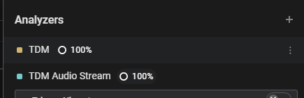

### Decode speed settings

Real SDK measurements on 8ch/16bit TDM data (non-batched mode):

| Setting | Decode time | Speedup |
|---------|------------:|--------:|
| Full + All markers (default) | 2.83s | 1.0x |
| Minimal + Slot markers | 1.54s | 1.8x |
| Off + None | 0.91s | 3.1x |

For **protocol debugging** (non-batched), use **Minimal + Slot boundaries** for a good balance of speed and data table visibility.

### Disable UI display for streaming (critical)

Logic 2's "Show in data table" and "Stream to terminal" options cause the analyzer results to be indexed for display. **This indexing takes 50-100x longer than the actual decode.** For realtime streaming, you must disable both:

1. Right-click the analyzer name in Logic 2's sidebar
2. Uncheck **Show in data table**
3. Uncheck **Stream to terminal**

With these enabled, a 3-second 8ch/16bit capture takes over 100 seconds to process. With these disabled, the same capture processes in under 3 seconds.

## Exporting data as a wave file

Logic 2 does not support custom export types for Low Level Analyzers — the only export mechanism available to analyzer plugins is the `TXT/CSV` export path. This is a confirmed Saleae design decision, not a temporary limitation. This analyzer works around this by adding an export format selector in the analyzer settings: the "Export to TXT/CSV" action produces either CSV or WAV output based on that setting. To export the captured data as a wave file, follow these steps:

1. Open the analyzer settings, click on the "Select export file type" dropdown and select "WAV" from the list. 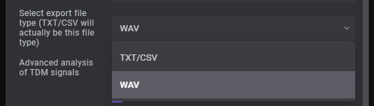
1. Save the settings
1. When analysis is complete, click on the three dots next to the analyzer and select "Export to TXT/CSV" 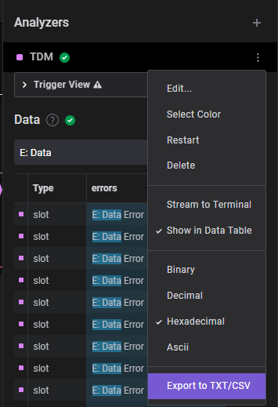
1. Once the file is written, the contents of the file will be set based on the export file type in the analyzer settings, but the extension will always be either `.txt` or `.csv` depending on what you selected when you saved the file.  _You must change the extension yourself after the data is exported._

#### Things to be aware of when exporting a wav file

- The sample rate for the exported wave file is set from the sample rate in the analyzer settings
- The number of channels is set from the number of slots in the analyzer settings.
  - If the decoded data contains more slots per frame than specified in the settings, the extra decoded slots will be ignored and not put into the wave file
  - If the decoded data contains less slots per frame than specified in the settings, the frame sync signal will be ignored and the slots will populate the wave file as if they were in order.  For example, if you specified 4 slots per frame in the settings, but the data only contains 3 slots per frame, then the wave file will be populated with 4 channels per sample consiting of:
  ```
  // F# is frame number and S# is slot #. So F3S2 is frame 3 slot 2's data
  [F1S1, F1S2, F1S3, F2S1]
  [F2S2, F2S3, F3S1, F3S2]
  [F3S3, F4S1, F4S2, F4S3]
  ...
  ```
- Data in the wave file is stored in the following bit depth:
  ```
   2 -  8 data bits :  8 bits per channel
   9 - 16 data bits : 16 bits per channel
  17 - 32 data bits : 32 bits per channel
  33 - 40 data bits : 40 bits per channel
  41 - 48 data bits : 48 bits per channel
  49 - 64 data bits : 64 bits per channel
  ```
- Data bit settings above 32 are "supported", but the wave files generated are not likely to open.
- For captures that fit within 4 GiB, the wave file uses a standard PCM header. For captures exceeding 4 GiB, the analyzer automatically produces an RF64 file (EBU TECH 3306) with a ds64 chunk containing the true 64-bit sizes. The threshold is computed from the capture frame count, channel count, and bit depth before export begins. RF64 files open in Audacity, FFmpeg, and other tools that support the format. Standard PCM exports have been tested to work in Audacity with channel counts from 1 to 256, and bit depths up to 32 bits. Bit depths above 32 bits do not open in Audacity with either format.
- Data bits are always scaled to ensure that the maximum values are always achievable.
  - For example, with 2 data bits, the values will map to
    ```
    0x1 -> +0.5
    0x0 ->  0
    0x3 -> -0.5
    0x2 -> -1.0
    ```
- The headers of the wave file are updated every 10 ms of audio data, so if the analyzer crashes or the export is cancelled early, the most data that will be lost is the most recently written 10 ms.

# High Level Analyzers (HLAs)

Two HLAs extend the TDM LLA with audio-focused features. Both run as Logic 2
extensions on top of the TdmAnalyzer.

## HLA: TDM WAV Export

Exports selected TDM slots to a WAV file in real time during capture. This is
separate from the built-in LLA export - the HLA approach allows slot selection
and writes incrementally during capture rather than as a post-capture step.
Note: use a standard (non-looping) capture for WAV export - see
[Known Limitations](#known-limitations).

See the [TDM WAV Export README](hla-wav-export/README.md) for full documentation.

**Quick start:**

1. Load the extension in Logic 2 (Extensions → Load Existing Extension → `hla-wav-export/`)
2. Add **"TDM WAV Export"** after the TdmAnalyzer LLA
3. Configure slots, output path, and bit depth
4. Start capturing — the WAV file is written in real time

## HLA: TDM Audio Stream

Streams selected TDM slots as live PCM audio over TCP. A companion CLI tool
and GUI connect to the stream and play it through any audio output device -
hear decoded TDM audio in real time. Works with both standard and looping
captures when Audio Batch Mode keeps the HLA at 100% throughput.

See the [TDM Audio Stream README](hla-audio-stream/README.md) for full
documentation, platform-specific setup, test harness, and debugging tips.

**Quick start - live audio streaming:**

1. **Configure the LLA** with Audio Batch Size set to 64 (or higher for many channels):

   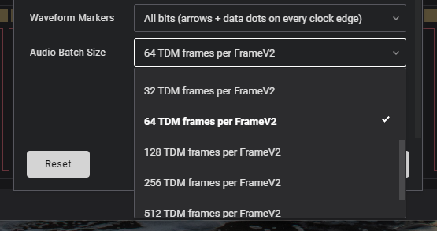

2. **Add the Audio Stream HLA** on top of the TDM LLA. Configure the slots to stream, TCP port, and output bit depth:

   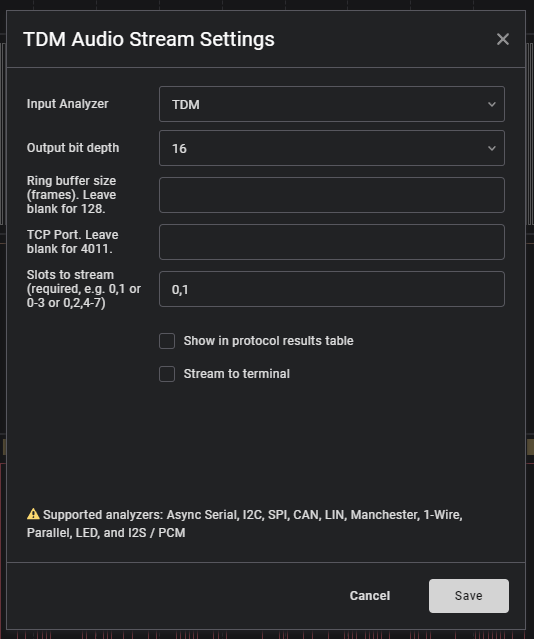

3. **Install and launch the companion tool:**

   ```bash
   pip install tools/tdm-audio-bridge/
   tdm-audio-bridge gui
   ```

   Or double-click `tools/tdm-audio-bridge/launch-gui.bat` (Windows) or run `./launch-gui.sh` (macOS/Linux).

4. **Start a live capture** in Logic 2. The bridge GUI will connect and begin playing audio:

   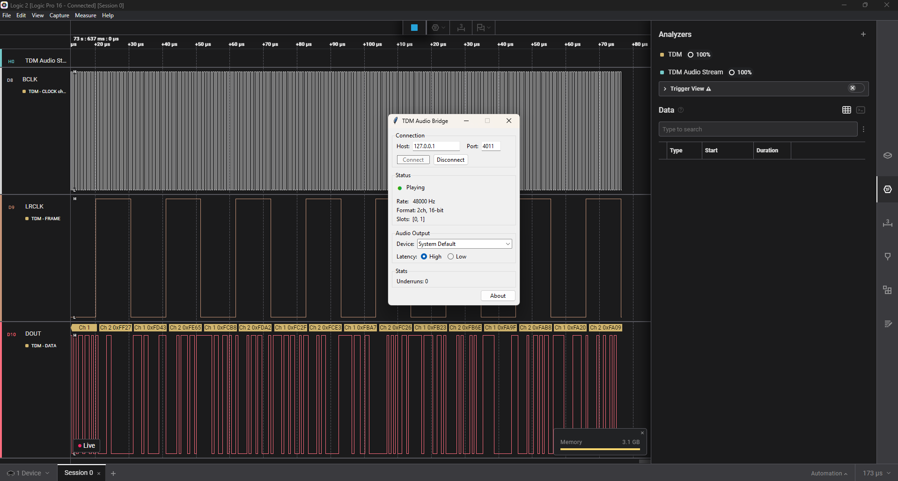

   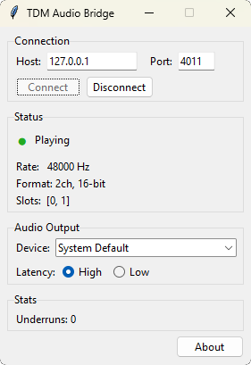

**Important:** The HLA progress indicator must show **100%** for clean streaming. If it shows less (e.g., 54%), increase the Audio Batch Size in the LLA settings. See [Audio Batch Mode](#audio-batch-mode-for-real-time-streaming) for recommended values.

# Known Limitations

## Looping (rolling) capture mode

Looping capture works for real-time audio streaming **as long as the HLA keeps
up with the data rate** (progress indicator at 100%). With Audio Batch Mode
enabled at the recommended batch size, this is reliably achievable.

If the HLA falls behind (progress below 100%), Logic 2's circular buffer will
eventually evict sample data that the analyzer still needs, causing decode
errors. This is not a bug - it is the expected behavior when processing can't
keep up with capture. The fix is to increase the Audio Batch Size until the
HLA reaches 100%. See [Audio Batch Mode](#audio-batch-mode-for-real-time-streaming)
for recommended values by configuration.

For the WAV Export HLA, looping capture is not recommended - the WAV file grows
indefinitely and there is no mechanism to wrap or truncate it when the circular
buffer rolls over.

See [Saleae's backlog error documentation](https://support.saleae.com/getting-help/troubleshooting/backlog-error)
for background on how Logic 2 handles buffer eviction.

# Install instructions

To install a pre-built analyzer, see Saleae's guide:
[Installing a community shared protocol analyzer](https://support.saleae.com/community/community-shared-protocols#installing-a-low-level-analyzer)

# Building from source

This project uses CMake with FetchContent to automatically download the Saleae AnalyzerSDK from GitHub during the configure step — no manual SDK installation is needed. An internet connection is required on the first configure run.

The build produces a shared library in the `Analyzers/` subdirectory of your build directory:

| Platform | Output file |
|----------|-------------|
| Linux | `build/Analyzers/libtdm_analyzer.so` |
| macOS | `build/<arch>/Analyzers/libtdm_analyzer.so` |
| Windows | `build\Analyzers\Release\tdm_analyzer.dll` |

## Prerequisites

All platforms require **CMake 3.13+** and **git**.

| Platform | Additional requirements |
|----------|------------------------|
| Linux | GCC 5+ and `build-essential` (`sudo apt-get install build-essential cmake`) |
| macOS | Xcode with command line tools (`xcode-select --install`) |
| Windows | Visual Studio 2017+ with the "Desktop development with C++" workload |

## Linux

```bash
cmake -B build -DCMAKE_BUILD_TYPE=Release
cmake --build build
```

The built library is `build/Analyzers/libtdm_analyzer.so`.

For a debug build (required for GDB debugging):
```bash
cmake -B build-debug -DCMAKE_BUILD_TYPE=Debug
cmake --build build-debug
```

## macOS

Logic 2 supports both Apple Silicon and Intel Macs natively, but universal binaries are **not supported** by the AnalyzerSDK. You must build for each architecture separately.

Build for your Mac's architecture (or both for distribution):
```bash
# Apple Silicon (arm64)
cmake -B build/arm64 -DCMAKE_BUILD_TYPE=Release -DCMAKE_OSX_ARCHITECTURES=arm64
cmake --build build/arm64

# Intel (x86_64)
cmake -B build/x86_64 -DCMAKE_BUILD_TYPE=Release -DCMAKE_OSX_ARCHITECTURES=x86_64
cmake --build build/x86_64
```

If you omit `-DCMAKE_OSX_ARCHITECTURES`, CMake builds for your host architecture by default.

## Windows

From a Developer Command Prompt or terminal with Visual Studio in your PATH:
```bat
cmake -B build -A x64
cmake --build build --config Release
```

The built DLL is `build\Analyzers\Release\tdm_analyzer.dll`.

You can also open the generated solution directly in Visual Studio:
```bat
build\tdm_analyzer.sln
```

## Debugging on Linux

The Logic 2 AppImage launches multiple processes. Your analyzer is loaded by a child `--type=renderer` process, not the main process. To attach GDB:

1. Open Logic 2 and add the TDM analyzer (the shared library is loaded when the analyzer is added).
2. Find the process that loaded the library:
   ```bash
   ps aux | grep 'Logic' | awk '{print $2}' | xargs -I % lsof -p % 2>/dev/null | grep libtdm_analyzer.so | awk '{print $2}'
   ```
3. Attach GDB:
   ```bash
   gdb ./libtdm_analyzer.so
   (gdb) attach <pid>
   (gdb) break TdmAnalyzer::WorkerThread
   ```

If you get a "ptrace: Operation not permitted" error:
```bash
sudo sysctl -w kernel.yama.ptrace_scope=0
```

# Migration Guide

## v2.5.0 — Audio Batch Mode for real-time streaming

New "Audio Batch Size" setting enables real-time audio streaming at stereo
48kHz and above. Set to 64 for most configurations. When enabled, the LLA
packs N TDM frames into a single FrameV2 with PCM data, reducing HLA decode
calls from 96,000/sec to 750/sec (at batch=64). Existing captures default
to Off (batch=0) with no behavior change.

See [Audio Batch Mode](#audio-batch-mode-for-real-time-streaming) for the
full configuration guide and recommended batch sizes.

## v2.4.0 — Performance tuning and OOM fix

Two new analyzer settings control the decode speed/detail tradeoff. Existing
captures will use the default (Full + All markers), so no action is needed
for backward compatibility.

**For realtime audio streaming users:** Set "Audio Batch Size" to 64 and
disable "Show in data table" and "Stream to terminal" (right-click analyzer
in sidebar). See [Performance Tuning](#performance-tuning) for details.

## v2.1.0 — FrameV2 schema overhaul

The FrameV2 schema was reworked for structured error reporting. HLA scripts that
read decoded slot frames must update their field access:

```python
# Before (v2.0.0)
channel = frame.data["channel"]           # integer, 0-based
errors  = frame.data["errors"]            # string like "E: Short Slot E: Data Error "
warnings = frame.data["warnings"]         # string like "W: Extra Slot "

# After (v2.1.0+)
slot     = frame.data["slot"]             # integer, 0-based (same value, renamed)
severity = frame.data["severity"]         # "error", "warning", or "ok"
is_short = frame.data["short_slot"]       # bool
is_extra = frame.data["extra_slot"]       # bool
is_bclk  = frame.data["bitclock_error"]   # bool
is_miss  = frame.data["missed_data"]      # bool
is_sync  = frame.data["missed_frame_sync"]  # bool
low_rate = frame.data["low_sample_rate"]  # bool
```

A new `"advisory"` frame type (distinct from `"slot"`) is emitted as the first
row when the capture sample rate is below 4x the bit clock.

## v2.0.0 — FrameV2 key rename

The `"frame #"` FrameV2 field has been renamed to `"frame_number"`.
Update any HLA scripts that access this field:

```python
# Before (v1.x)
frame_number = frame.data["frame #"]

# After (v2.0+)
frame_number = frame.data["frame_number"]
```

See [CHANGELOG.md](CHANGELOG.md) for the full list of changes.
