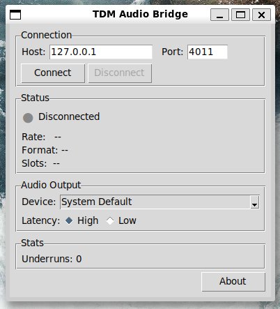
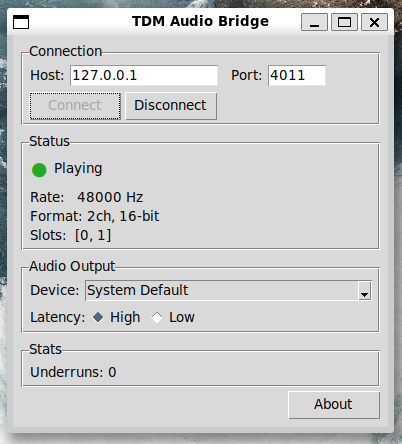

# TDM Audio Stream - Live PCM Streaming HLA

A Saleae Logic 2 High Level Analyzer (HLA) that streams selected TDM slots as
live PCM audio over TCP. Listen to decoded TDM audio in real time as Logic 2
captures data.

## Quick Start

```bash
# 1. Install the companion playback tool
pip install tools/tdm-audio-bridge/

# 2. Load the HLA in Logic 2 (Extensions → Load Existing Extension → hla-audio-stream/)

# 3. Add "TDM Audio Stream" to your analyzer chain after the TdmAnalyzer LLA

# 4. Start capturing in Logic 2, then connect the bridge:
tdm-audio-bridge listen
```

The bridge auto-detects sample rate, channels, and bit depth from the HLA
handshake - no manual configuration needed.

### GUI Mode

For a no-terminal experience, launch the graphical interface:

```bash
tdm-audio-bridge gui
```

On Windows, `tdm-audio-bridge-gui.exe` (installed by pip) can be
double-clicked directly - no console window appears.




## How It Works

```
Logic 2 capture
    │
    ▼
┌──────────────┐     FrameV2 slot frames     ┌──────────────────┐
│ TdmAnalyzer  │ ──────────────────────────►  │ TDM Audio Stream │
│   (C++ LLA)  │                              │     (HLA)        │
└──────────────┘                              └────────┬─────────┘
                                                       │ TCP (127.0.0.1:4011)
                                                       │ JSON handshake + raw PCM
                                                       ▼
                                              ┌──────────────────┐
                                              │ tdm-audio-bridge │
                                              │   (CLI tool)     │
                                              └────────┬─────────┘
                                                       │
                                                       ▼
                                                  Audio device
                                                 or virtual card
```

1. The C++ LLA decodes TDM signals into FrameV2 slot frames.
2. The HLA collects slots into PCM frames, derives the sample rate from frame
   timing, and streams interleaved PCM over a local TCP connection.
3. The companion CLI connects, reads the JSON handshake, and plays the PCM
   stream through any audio output device.

### TCP Protocol

On connect, the HLA sends a single newline-terminated JSON handshake:

```json
{"protocol":1,"sample_rate":48000,"channels":2,"bit_depth":16,"slot_list":[0,1],"buffer_size":128,"byte_order":"little"}
```

After the handshake, raw interleaved little-endian PCM follows continuously
(int16 for 16-bit, int32 for 32-bit). There is no framing - the client uses
the handshake metadata to interpret the byte stream.

A ring buffer (configurable size, default 128 frames) smooths timing between
the decode thread and the TCP sender. If the client falls behind, the oldest
frames are silently dropped.

## HLA Installation

1. In Logic 2, open the **Extensions** panel (right sidebar).
2. Click the **three-dots** menu icon at the top of the panel.
3. Select **"Load Existing Extension..."**.
4. Navigate to the `hla-audio-stream/` folder in this repository.
5. Select `extension.json` and click **Open**.
6. The extension appears as **"TDM Audio Stream"** in the Extensions panel.

Add it to your analyzer chain after the **TdmAnalyzer** LLA.

### HLA Settings

| Setting | Description | Default | Example |
|---------|-------------|---------|---------|
| **Slots** | Slot indices to stream (comma-separated or ranges) | - | `0,1` or `0-3` or `1,3-5,7` |
| **TCP Port** | Local TCP server port | `4011` | `4012` |
| **Ring Buffer Size** | Frame buffer capacity (oldest dropped on overflow) | `128` | `256` |
| **Bit Depth** | Sample bit depth (ignored in Audio Batch Mode - LLA bit depth is used) | `16` | `32` |

## Companion CLI: tdm-audio-bridge

### Installation

**Prerequisites:** Python 3.9+ and PortAudio.

Install PortAudio first (platform-specific), then install the bridge from the
repository root (or the root of the release zip):

#### Linux

```bash
sudo apt install libportaudio2
pip install tools/tdm-audio-bridge/
```

#### macOS

```bash
brew install portaudio
pip install tools/tdm-audio-bridge/
```

#### Windows

PortAudio ships with the Python `sounddevice` package on Windows, so no
separate install is needed:

```powershell
pip install tools\tdm-audio-bridge\
```

If you plan to use a virtual sound card like VB-CABLE, install that first so
it appears in the device list.

### Usage

#### List audio output devices

```bash
tdm-audio-bridge devices
```

Output:

```
Available output devices:

  [ 0] Microsoft Sound Mapper - Output (2 ch)
  [ 3] Speakers (Realtek Audio) (2 ch)
  [ 5] CABLE Input (VB-Audio Virtual Cable) (8 ch)

Use --output <index> or --output <name> with 'listen'.
```

#### Connect and play

```bash
# Default: connect to 127.0.0.1:4011, use default audio device
tdm-audio-bridge listen

# Specify a device by name (case-insensitive substring match)
tdm-audio-bridge listen --output "VB-Cable"

# Specify a device by index
tdm-audio-bridge listen --output 5

# Use a different port
tdm-audio-bridge listen --port 4012

# Low-latency mode (may increase risk of underruns)
tdm-audio-bridge listen --latency low

# Single-shot: exit on disconnect instead of reconnecting
tdm-audio-bridge listen --no-reconnect

# Verbose output (connection details)
tdm-audio-bridge -v listen

# Debug output (all protocol traffic)
tdm-audio-bridge -vv listen
```

The bridge pre-buffers 500 ms of audio before starting playback to prevent
initial underruns. You will see:

```
Connecting to 127.0.0.1:4011...
Connected: 2ch, 48000Hz, 16-bit
Slots: [0, 1]
Buffering...
Playing...
```

#### Auto-reconnection

By default, the bridge automatically reconnects if the HLA restarts (e.g. when
a new Logic 2 capture starts). Use `--no-reconnect` to exit on disconnect
instead.

### Virtual Sound Cards

To present TDM audio as a system audio device that other applications can use
(DAWs, VoIP, streaming software), route through a virtual sound card:

| Platform | Software | Channels | Notes |
|----------|----------|----------|-------|
| Windows | [VB-CABLE](https://vb-audio.com/Cable/) | 8 (A+B) | Free, installs as audio device pair |
| macOS | [BlackHole](https://github.com/ExistentialAudio/BlackHole) | 2, 16, or 64 | Open source, choose channel count at install |
| Linux | PipeWire null-sink | 64+ | Built-in with modern distros |

**Setup:**

1. Install the virtual sound card for your platform.
2. Point the bridge at the virtual device:
   ```bash
   tdm-audio-bridge listen --output "CABLE Input"      # Windows (VB-CABLE)
   tdm-audio-bridge listen --output "BlackHole"         # macOS
   tdm-audio-bridge listen --output "null-sink"         # Linux (PipeWire)
   ```
3. In your target application, select the virtual device as the audio input.

#### PipeWire null-sink (Linux)

```bash
# Create a 2-channel null-sink
pactl load-module module-null-sink sink_name=tdm_audio \
    sink_properties=device.description="TDM_Audio" \
    channels=2 rate=48000

# Point the bridge at it
tdm-audio-bridge listen --output "TDM_Audio"

# The corresponding source (TDM_Audio.monitor) appears as an input device
```

## Test Harness

The test harness (`tools/tdm-test-harness/`) drives the HLA outside of Logic 2
without any Saleae hardware. It generates test signals, feeds them through the
HLA's decode path, and verifies the TCP output.

### Installation

```bash
pip install tools/tdm-test-harness/
```

No additional dependencies - the harness uses only the Python standard library
and Click.

### Commands

#### Serve a test signal (manual listening)

```bash
# Stereo 440 Hz sine at 48 kHz, listen with tdm-audio-bridge
tdm-test-harness serve --signal sine:440 --channels 2

# 4-channel with per-channel frequencies
tdm-test-harness serve --signal sine:440,880,1320,1760 --channels 4

# Play a WAV file through the pipeline
tdm-test-harness serve --signal wav:/path/to/file.wav

# Custom port and sample rate
tdm-test-harness serve --signal sine:1000 --port 4012 --sample-rate 44100

# Specify duration (default: infinite for sine/silence/ramp, file length for WAV)
tdm-test-harness serve --signal sine:440 --duration 10
```

#### Automated verification

```bash
# Basic pass/fail test (exit code 0 = pass)
tdm-test-harness verify --signal sine:440 --duration 0.5 --json

# Multi-channel
tdm-test-harness verify --signal sine:440,880 --channels 2 --json

# 32-bit depth
tdm-test-harness verify --signal ramp --bit-depth 32 --json

# All available signals
tdm-test-harness signals
```

#### Audio quality analysis (requires sox)

```bash
# Capture TCP stream to WAV (while serve is running on another terminal)
tdm-test-harness capture --port 4011 --duration 3 --skip 0.5 -o test.wav

# Analyze for glitches, dropouts, and frequency accuracy
tdm-test-harness analyze test.wav --freq 440
```

The `analyze` command uses sox to:
- Verify the dominant frequency matches the expected value
- Detect glitches via bandreject filter + windowed RMS (50 ms windows, -40 dB threshold)
- Detect dropouts via silence detection duration comparison

#### Full quality sweep

```bash
# Run all 11 automated tests
tdm-test-harness quality-sweep
```

The quality sweep tests:

| # | Category | Test |
|---|----------|------|
| 1-4 | Signal integrity | 24 kHz, 44.1 kHz, 48 kHz, 96 kHz mono 16-bit sine |
| 5 | Multi-channel | Stereo sine (440+880 Hz) |
| 6 | Multi-channel | 4-channel sine (440+880+1320+1760 Hz) |
| 7 | Bit depth | 32-bit sine |
| 8-9 | Loop boundary | Phase-perfect 440 Hz sine, captures across 2+ loop boundaries |
| 10 | Resilience | Reconnection: disconnect mid-stream, reconnect, verify data integrity |
| 11 | Resilience | Buffer pressure: 32-frame ring buffer, verify frame alignment under overflow |

#### Available test signals

```bash
tdm-test-harness signals
```

| Signal | Description |
|--------|-------------|
| `sine:<freq>` | Sine wave at the given frequency (all channels) |
| `sine:<f1>,<f2>,...` | Per-channel sine wave frequencies |
| `silence` | All zeros |
| `ramp` | Linear ramp from -max to +max |
| `wav:<path>` | Play a WAV file |

## Platform Notes

### Windows

- Logic 2 and the HLA run normally.
- Install the bridge with `pip install tools\tdm-audio-bridge\`.
- PortAudio is bundled with the `sounddevice` Python package - no separate
  install needed.
- If using WSL2 with Logic 2 on Windows, the bridge should run on Windows
  (not WSL2) for reliable audio output. The HLA's TCP server on WSL2 is
  accessible from Windows via localhost forwarding.

### macOS

- Install PortAudio with `brew install portaudio` before installing the bridge.
- Logic 2 supports both Apple Silicon and Intel Macs natively. The C++ LLA must
  be built for the correct architecture (see the main project README).
- BlackHole is the recommended virtual sound card for multi-channel routing.

### Linux

- Install PortAudio with `sudo apt install libportaudio2` (Debian/Ubuntu) or
  the equivalent for your distribution.
- PipeWire (default on recent Fedora, Ubuntu 22.10+) provides excellent
  low-latency audio and built-in virtual device support.
- PulseAudio works but may have higher latency.

### WSL2 Limitations

WSL2's audio path (WSLg → PulseAudio → RDP transport) introduces latency and
can produce ALSA underruns (audible stutters) that are not caused by the TDM
pipeline. For reliable audio testing:

- **For listening:** Run the bridge on native Windows (not WSL2). The HLA's TCP
  server in WSL2 is accessible from Windows via `127.0.0.1`.
- **For automated testing:** Use `tdm-test-harness capture` to record the TCP
  stream directly to WAV, bypassing audio hardware entirely. Then analyze with
  `tdm-test-harness analyze`.

## Known Limitations

### Looping (rolling) capture mode

Looping capture **works for real-time audio streaming** as long as the HLA
keeps up with the data rate (progress indicator at 100%). With Audio Batch
Mode enabled at the recommended batch size in the LLA settings, this is
reliably achievable - the HLA consumes data faster than Logic 2 can evict it.

If the HLA falls behind (progress below 100%), Logic 2's circular buffer will
eventually evict sample data that the LLA still needs, causing both the LLA
and HLA to enter an error state. This is not a bug - it is the expected
behavior when processing can't keep up with capture.

**If you see errors in looping mode:**

- **Increase the Audio Batch Size** in the LLA settings until the HLA progress
  shows 100%. See the recommended batch sizes table in the main README.
- **Disable "Show in data table" and "Stream to terminal"** (right-click
  analyzer in sidebar) - these add 50-100x indexing overhead.

**If errors persist after tuning:**

- **Restart the analyzer** via the three-dot menu after the error appears.
- **Increase the memory buffer size** in Logic 2's capture settings - this
  gives more headroom before eviction begins.
- **Reduce the capture sample rate** to lower the data arrival rate.
- **Disable the glitch filter** if enabled - it is a known performance
  bottleneck in the processing pipeline
  ([discuss.saleae.com #1395](https://discuss.saleae.com/t/please-allow-for-lower-memory-limit-and-temporary-analyzer-disable/1395)).

**References:**

- [Capture Modes](https://support.saleae.com/product/user-guide/using-logic/capture-modes) - Saleae documentation on looping mode
- [Backlog Error](https://support.saleae.com/getting-help/troubleshooting/backlog-error) - Saleae acknowledgment of analyzer/buffer interaction issues
- [Analyzer error in looping mode](https://discuss.saleae.com/t/analyzer-error-causes-api-code-to-wait-infinitely/3551/1) - Community report confirming buffer-size correlation
- [Memory buffer size inaccuracy](https://discuss.saleae.com/t/logic-2-3-19-how-to-make-the-memory-buffer-size-work/944) - Buffer size does not account for analyzer memory usage
- [Analyzer temp file accumulation](https://discuss.saleae.com/t/i2c-analyzer-hoarding-temp-files/1249) - Analyzer results not garbage-collected during looping capture

## Debugging

### No audio / "Connection refused"

1. Verify the HLA is loaded and running in Logic 2 (or `tdm-test-harness serve`
   is running).
2. Check the port matches (`--port` on both sides, default 4011).
3. Verify nothing else is bound to the port:
   ```bash
   # Linux/macOS
   ss -tlnp | grep 4011

   # Windows (PowerShell)
   netstat -ano | findstr 4011
   ```

### Audio plays but with glitches

1. Increase the ring buffer size in the HLA settings (default 128, try 512 or
   1024).
2. Use `--latency high` on the bridge (default).
3. Check system audio load - close other audio-heavy applications.
4. On WSL2, switch to native Windows playback (see WSL2 Limitations above).
5. Use `tdm-test-harness capture` + `analyze` to determine if glitches are in
   the pipeline or the audio output path.

### Bridge connects but no audio plays

1. Verify the HLA has derived the sample rate (it needs at least 2 frames from
   the same slot to calculate timing). Check the bridge output - it should
   show the handshake details.
2. Verify the correct slots are selected. If the selected slots don't appear in
   the TDM data, the HLA produces silence.
3. Use `-v` or `-vv` for verbose logging:
   ```bash
   tdm-audio-bridge -vv listen
   ```

### Wrong sample rate detected

The HLA derives the sample rate from the time interval between consecutive
frames of the same slot. If the Logic 2 capture sample rate is too low relative
to the TDM bit clock, the derived rate may be inaccurate. Ensure your capture
sample rate is at least 4x the TDM bit clock frequency.

### Testing without Logic 2

Use the test harness to verify the full pipeline without any Saleae hardware:

```bash
# Terminal 1: serve a test signal
tdm-test-harness serve --signal sine:440 --channels 2

# Terminal 2: play it
tdm-audio-bridge listen

# Terminal 3 (optional): capture for analysis
tdm-test-harness capture --duration 5 -o test.wav
tdm-test-harness analyze test.wav --freq 440
```

## Architecture

### HLA internals (TdmAudioStream.py)

```
decode(frame) calls:
    ├── _try_derive_sample_rate()  - measures inter-frame timing
    ├── _try_flush()               - flush-before-accumulate boundary detection
    └── _accum[slot] = sample      - accumulate current frame's data
                │
                ▼ (on frame boundary)
         _enqueue_frame()
                │
                ▼
         Ring buffer (deque, maxlen=N)
                │
                ▼ (_sender_loop thread, batches up to 1024 frames)
         TCP sendall() → client
```

**Key design decisions:**

- **Flush-before-accumulate:** `_try_flush(frame_num)` is called before
  accumulating the new slot's data, ensuring the flush reads the previous
  frame's clean accumulator.
- **Sender batching:** The sender thread drains up to 1024 frames from the ring
  buffer per `sendall()` call. Without batching, stereo 48 kHz streams generate
  48,000+ individual 4-byte TCP sends per second, causing GIL contention.
- **Deferred handshake:** If a client connects before the sample rate is known,
  the handshake is deferred until the rate is derived from frame timing.
- **Ring buffer overflow:** When the buffer is full, the oldest frames are
  dropped silently. This prevents unbounded memory growth if the client falls
  behind.

### Companion CLI internals (tdm-audio-bridge)

```
StreamClient (client.py)
    ├── TCP connect + read_handshake()
    ├── Deliver PCM chunks via on_data callback
    └── Auto-reconnect on disconnect

Player (player.py)
    ├── Pre-buffer 500ms before starting playback
    ├── sounddevice OutputStream with callback
    └── Callback pulls from internal byte buffer
```

## Contributing

### Project structure

```
hla-audio-stream/
├── TdmAudioStream.py    # The HLA - runs inside Logic 2
├── _tdm_utils.py        # Shared utilities (slot parsing, sign extension)
└── extension.json       # Logic 2 extension manifest

tools/tdm-audio-bridge/
├── tdm_audio_bridge/
│   ├── cli.py           # Click CLI (listen, gui, devices commands)
│   ├── gui.py           # tkinter GUI (~500 lines)
│   ├── client.py        # Auto-reconnecting TCP client
│   ├── player.py        # sounddevice playback engine
│   └── protocol.py      # Handshake parsing and PCM unpacking
└── pyproject.toml

tools/tdm-test-harness/
├── tdm_test_harness/
│   ├── cli.py           # Click CLI (serve, verify, capture, analyze, quality-sweep, signals)
│   ├── signals.py       # Signal generators (sine, silence, ramp, WAV)
│   ├── frame_emitter.py # Converts samples to fake AnalyzerFrames
│   ├── hla_driver.py    # Drives HLA outside Logic 2
│   └── verifier.py      # TCP client for automated verification
└── pyproject.toml
```

### Running self-tests

Each module includes a self-test block (`if __name__ == '__main__'`):

```bash
# HLA self-test (TCP round-trip)
cd hla-audio-stream && python TdmAudioStream.py

# Test harness driver self-test
python tools/tdm-test-harness/tdm_test_harness/hla_driver.py

# Signal generators self-test
python tools/tdm-test-harness/tdm_test_harness/signals.py
```

### Running the quality sweep

```bash
# Requires sox for audio analysis
# Linux: sudo apt install sox
# macOS: brew install sox
# Windows: install from https://sox.sourceforge.net/

tdm-test-harness quality-sweep
```

All 11 tests should pass. Any failure indicates a pipeline regression.

### Key conventions

- **Logic 2 HLA constraints:** Settings are declared at class level and
  injected by Logic 2 before `__init__` runs. The HLA must handle init failures
  gracefully via the deferred-error pattern.
- **No external dependencies in the HLA:** `TdmAudioStream.py` uses only the
  Python standard library. It must run inside Logic 2's embedded Python.
- **Companion tools use Click:** All CLIs follow the Click framework with `-h`/
  `--help` support and `-v`/`-vv` verbosity flags.

## Building the C++ LLA

The HLA depends on the TdmAnalyzer C++ LLA for upstream FrameV2 data. See the
[main project README](../README.md#building-from-source) for build instructions
covering Linux, macOS, and Windows.

## Why TCP instead of UDP?

The audio stream uses TCP over localhost (`127.0.0.1`), not UDP. This is a
deliberate choice:

- **Localhost has no network.** TCP's overhead (retransmission, congestion
  control, head-of-line blocking) never activates on loopback. The kernel just
  copies bytes between socket buffers. Latency difference vs UDP is effectively
  zero.
- **Raw PCM has no resync mechanism.** The stream is unframed interleaved PCM
  bytes. Losing even one byte misaligns every subsequent sample - channels swap,
  values corrupt, and there is no way to recover without restarting. UDP would
  require adding our own framing (sequence numbers, packet boundaries, length
  headers) to detect and handle drops - reimplementing half of TCP.
- **The handshake requires reliability.** The first thing sent is a JSON
  metadata line (sample rate, channels, bit depth). It must arrive intact. UDP
  would need ACK/retry logic for this anyway.
- **Backpressure is handled by the ring buffer.** The HLA's ring buffer drops
  oldest frames when the consumer falls behind. TCP flow control just means the
  sender blocks when the kernel buffer fills, which is fine - the ring buffer
  decouples decode from send.
- **UDP's advantages don't apply.** UDP wins when you have real network latency,
  can tolerate loss (codecs with resync points), or need multicast. None of
  those apply here: loopback path, lossless PCM, single consumer.

## License

Licensed under the Apache License 2.0 - see [LICENSE](../LICENSE) for details.
